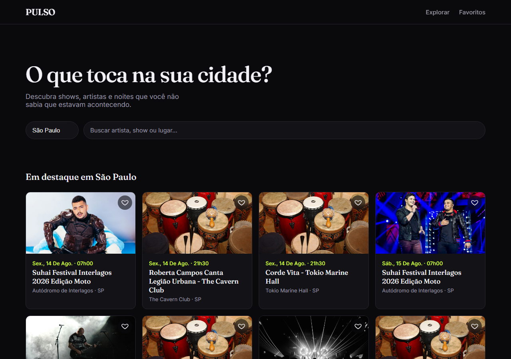
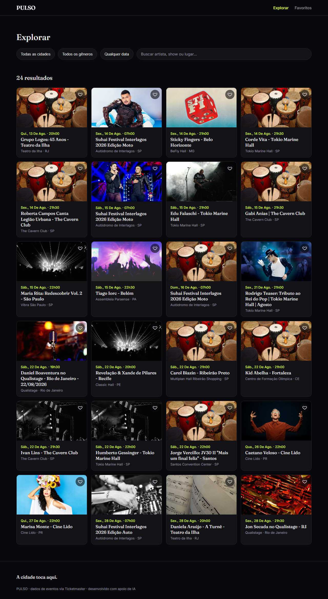
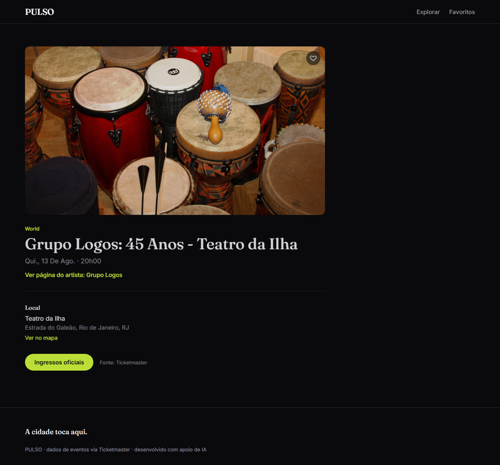
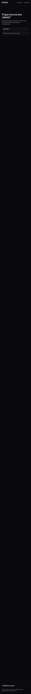
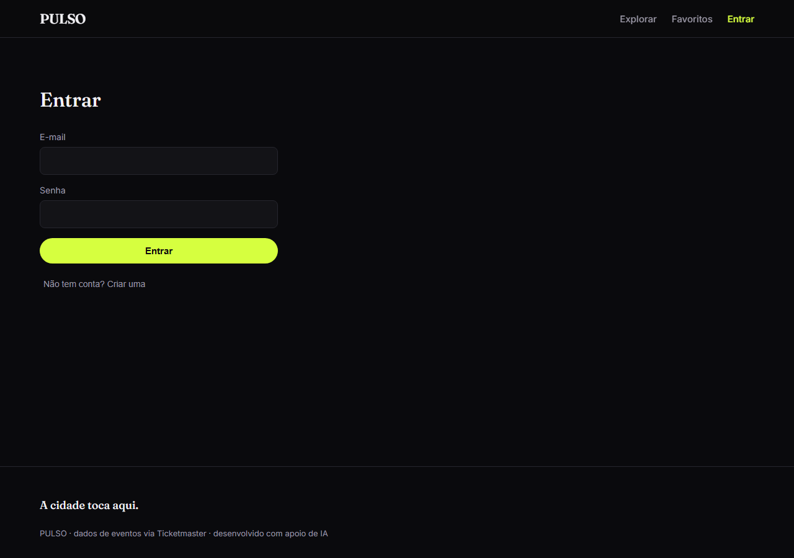

# PULSO

**A cidade toca aqui.**

Uma plataforma de descoberta de shows, artistas e casas de show, construída sobre dados reais e atuais — não uma lista de eventos escrita à mão.



## O problema

"O que está tocando na minha cidade essa semana?" é uma pergunta surpreendentemente difícil de responder bem. Sites de venda de ingresso são otimizados pra conversão, não pra descoberta; redes sociais são ruído. O PULSO tenta ser o meio do caminho: uma curadoria de shows reais, organizada por cidade, período, gênero e artista, com a sensação de "descoberta musical" em vez de só uma lista.

## A solução

Um app React que consome a **Ticketmaster Discovery API** em tempo real — sem dado inventado, sem JSON mockado — com estados de interface tratados de verdade (carregando, erro, vazio, imagem quebrada) e uma identidade visual própria: urbana, editorial, escura, sem clichês de "app de música" (nada de equalizador, nota musical ou neon cyberpunk genérico).

## Funcionalidades

- **Home**: hero com busca e seletor de cidade, shows em destaque, "acontecendo esta semana", "em alta", navegação por gênero, e locais mais movimentados da semana (derivado dos próprios eventos, sem chamada extra à API).
- **Explorar**: grid de eventos com filtros de cidade, gênero, período e busca livre — os filtros vivem na URL, então o link é compartilhável — com paginação ("Carregar mais").
- **Evento**: página de detalhe com artista, imagem, data, local (com link direto pro Google Maps), gênero, descrição, fonte e link oficial de ingresso.
- **Artista**: perfil com imagem, gênero e próximos eventos.
- **Conta**: cadastro (com apelido) e login por e-mail/senha via Supabase Auth.
- **Favoritos**: persistidos por usuário no Postgres (Supabase), protegidos por Row Level Security — exige login, funciona em qualquer aparelho.
- Título de aba dinâmico por página, dropdowns customizados (tema consistente, sem depender do `<select>` nativo do navegador), animações discretas (reveal on scroll, fade de imagem, microinteração de favoritar).

## Stack

- [React 19](https://react.dev/) + [Vite](https://vite.dev/) — sem TypeScript, JavaScript puro.
- [React Router 7](https://reactrouter.com/) — roteamento client-side.
- CSS puro (custom properties como design tokens, sem framework de CSS).
- [Ticketmaster Discovery API v2](https://developer.ticketmaster.com/) — dados de eventos, artistas e locais.
- [Supabase](https://supabase.com/) — autenticação e Postgres (favoritos por usuário).

Sem backend próprio escrito à mão — a Ticketmaster passa por um proxy de desenvolvimento (ver abaixo) que resolve CORS; o Supabase já autoriza chamadas diretas do navegador.

## Arquitetura

```
src/
├── pages/        # uma página por rota (Home, Explorar, Evento, Artista, Favoritos, Login)
├── components/    # UI reutilizável entre páginas (EventCard, Dropdown, StateMessage...)
├── services/      # portas de entrada pra APIs externas (ticketmaster.js, supabase.js)
├── hooks/         # estado + efeitos reutilizáveis (useEvents, useEvent, useArtist, useAuth, useFavorites)
├── context/       # estado compartilhado entre componentes distantes (AuthContext, FavoritesContext)
└── utils/         # funções puras (formatação de data, imagem, cidade → coordenadas...)
```

Dois fluxos de dados distintos convivem no app:

```
componente → hook (useEvents/useEvent/useArtist) → service (ticketmaster.js) → proxy → Ticketmaster
                                ↓
                        estado (loading/success/error) → UI

componente → hook (useAuth/useFavorites) → context → service (supabase.js) → Supabase (Auth + Postgres, com RLS)
```

## A API e suas limitações reais

A [Ticketmaster Discovery API](https://developer.ticketmaster.com/products-and-docs/apis/discovery-api/v2/) foi escolhida depois de comparar as alternativas com cobertura real pro Brasil (Songkick fechou aplicações novas, Bandsintown e Sympla não têm busca pública de todos os eventos, Eventbrite descontinuou o endpoint de busca). Ela cobre eventos, artistas ("attractions") e locais ("venues") num fluxo só, com plano gratuito de 5.000 chamadas/dia.

Duas limitações reais, descobertas testando com dados de verdade (não documentadas antecipadamente):

- **Sem CORS**: a API não autoriza chamadas diretas do navegador. Resolvido com um proxy no `vite.config.js` que injeta a `apikey` no lado do servidor — ela nunca é exposta ao código que roda no navegador (nem via variável `VITE_*`, que seria visível no bundle).
- **`venue.city` vem vazio pra maioria dos locais brasileiros.** O filtro de busca por cidade (`city=`) depende desse campo e não retornava nada pro Brasil, mesmo com eventos existindo de verdade. A correção foi trocar por busca geográfica (`latlong`+`radius`), já que as coordenadas dos locais vêm preenchidas corretamente — e usar o estado (UF) como texto de local quando a cidade não existe.

## Autenticação e favoritos por usuário

Favoritos são a única parte do app com estado que precisa "pertencer" a alguém — por isso, diferente dos dados de evento (buscados sob demanda, sem dono), viraram o motivo de trazer um backend de verdade.

- **Supabase Auth** cuida de cadastro/login/logout por e-mail e senha. A sessão fica salva pelo próprio `supabase-js` (não escrevi nada de token/cookie à mão).
- **Tabela `favorites` no Postgres** (`supabase/migrations/0001_favorites.sql`), com **Row Level Security**: cada usuário só lê/escreve as próprias linhas — regra aplicada *no banco*, não só checada no front-end. Testado na prática: uma consulta sem login retorna array vazio, mesmo com dados existindo na tabela.
- A key pública do Supabase (`VITE_SUPABASE_PUBLISHABLE_KEY`) é diferente da key da Ticketmaster: essa é pra ser exposta mesmo — quem protege os dados é o RLS, não o segredo da key. Por isso não precisa de proxy: o Supabase já autoriza chamadas diretas do navegador.
- Favoritar exige login (decisão consciente, não a única opção): manter um modo híbrido — favoritos anônimos em `localStorage` sincronizando com a conta no login — foi considerado e descartado por complexidade (merge de conflitos, migração única) desproporcional ao ganho pra este projeto.

## Estados de interface

Loading (skeleton, não spinner), erro (com "tentar de novo"), "não encontrado" (sem retry — não adianta tentar de novo um recurso que não existe), vazio (sem resultado pros filtros aplicados), imagem quebrada (fallback visual da marca, cobrindo tanto "sem imagem" quanto "URL que falhou ao carregar") — tratados em todas as páginas que dependem da API.

## Decisões técnicas

- **Sem Redux/Zustand.** A maior parte do estado é local a cada página (busca de dados isolada por hook). As exceções são `AuthContext` e `FavoritesContext`: dados que vários componentes distantes entre si (o coração de cada card, o header, a página de Favoritos) precisam ver e alterar ao mesmo tempo — Context usado só onde o problema realmente pede, não como padrão default.
- **Sem biblioteca de animação.** Reveal on scroll (`IntersectionObserver`), fade de imagem e microinteração de favoritar são todos CSS + um hook pequeno, respeitando `prefers-reduced-motion`.
- **Sem biblioteca de UI.** O dropdown customizado (`components/Dropdown.jsx`) existe porque o `<select>` nativo não permite estilizar o menu aberto (ele é desenhado pelo sistema operacional, não pela página) — reconstruído com `button`/`ul` e fechamento por clique-fora/Esc, em vez de trazer uma lib de componentes só por causa disso.
- **Filtros na URL** (`useSearchParams`), não só em estado local — torna o Explorar compartilhável/atualizável sem perder o filtro aplicado.

## Rodando localmente

```bash
npm install
```

Crie um `.env` na raiz (veja `.env.example`) com uma API key gratuita do [Ticketmaster Developer Portal](https://developer.ticketmaster.com/) e um projeto no [Supabase](https://supabase.com/):

```
TICKETMASTER_API_KEY=sua_key_aqui
VITE_SUPABASE_URL=https://seu-projeto.supabase.co
VITE_SUPABASE_PUBLISHABLE_KEY=sua_publishable_key_aqui
```

Rode a migração em `supabase/migrations/0001_favorites.sql` no SQL Editor do seu projeto Supabase antes de testar favoritos.

```bash
npm run dev
```

## Deploy

Hospedado na [Vercel](https://vercel.com/). Duas coisas específicas desse projeto valem explicar:

- **`api/ticketmaster/[...path].js`** é o equivalente de produção do proxy que existe em `vite.config.js` só pra desenvolvimento — o `npm run dev` não roda em produção, então o proxy de dev não existe lá. É uma Vercel Function (Node.js) que faz exatamente o mesmo papel: recebe a chamada do navegador, injeta a `apikey` no lado do servidor, repassa pra Ticketmaster. Detectada automaticamente pela Vercel por estar em `/api` — não precisa de configuração extra.
- **Variáveis de ambiente** precisam ser configuradas no painel do projeto na Vercel (Settings → Environment Variables), com os mesmos nomes do `.env` local: `TICKETMASTER_API_KEY`, `VITE_SUPABASE_URL`, `VITE_SUPABASE_PUBLISHABLE_KEY`.

Import automático: conectar o repositório do GitHub na Vercel já detecta o framework (Vite) e o diretório de build sem configuração manual.

## Screenshots

| Home | Explorar |
|---|---|
|  |  |

| Evento | Home (mobile) |
|---|---|
|  |  |

| Login |
|---|
|  |

## Aprendizados

- Dado real quebra suposições que documentação nenhuma avisa — o bug do `venue.city` vazio só apareceu testando com a key de produção, nunca com mock.
- CORS não é sobre validar quem está autenticado; é o navegador protegendo o usuário de scripts de terceiros usando a sessão dele escondido — vale a pena entender a diferença antes de "resolver" com gambiarra.
- Extrair um componente cedo demais é tão custoso quanto tarde demais. Vários componentes deste projeto (`EventRailSection`, `EventImage`, `Dropdown`) só nasceram depois de eu ver o mesmo bloco de código se repetir, não antes.
- Row Level Security move a responsabilidade de "quem pode ver o quê" pra dentro do banco, em vez de confiar só na lógica do front-end — uma linha de `using (auth.uid() = user_id)` protege contra qualquer jeito de contornar a UI, não só o caminho feliz.
- CSS `transition` declarada em dois arquivos diferentes pra propriedades diferentes (opacity num lugar, transform em outro) não se soma — a última sobrescreve a primeira silenciosamente. Custou um bug real de animação até perceber.

## Roadmap

**Feito:** autenticação e favoritos por usuário via Supabase/PostgreSQL (com Row Level Security), apelido no cadastro.

**Pendente antes de qualquer lançamento real:** a confirmação de e-mail está desativada no projeto Supabase (foi desligada durante o desenvolvimento por causa do limite de envio do plano gratuito) — precisa ser reativada com um provedor de e-mail próprio (SMTP customizado) antes de abrir cadastro pro público.

**Depois:** seguir artistas, busca por proximidade/geolocalização, mapa, recomendação, integração com calendário, notificações, compartilhamento.

---

Este projeto foi desenvolvido com apoio de ferramentas de IA (Claude), em um processo de pair programming — o código foi majoritariamente implementado por IA sob orientação e revisão constante do autor, que participou de toda decisão de arquitetura, produto e design, e é capaz de explicar o funcionamento de cada parte do sistema.
